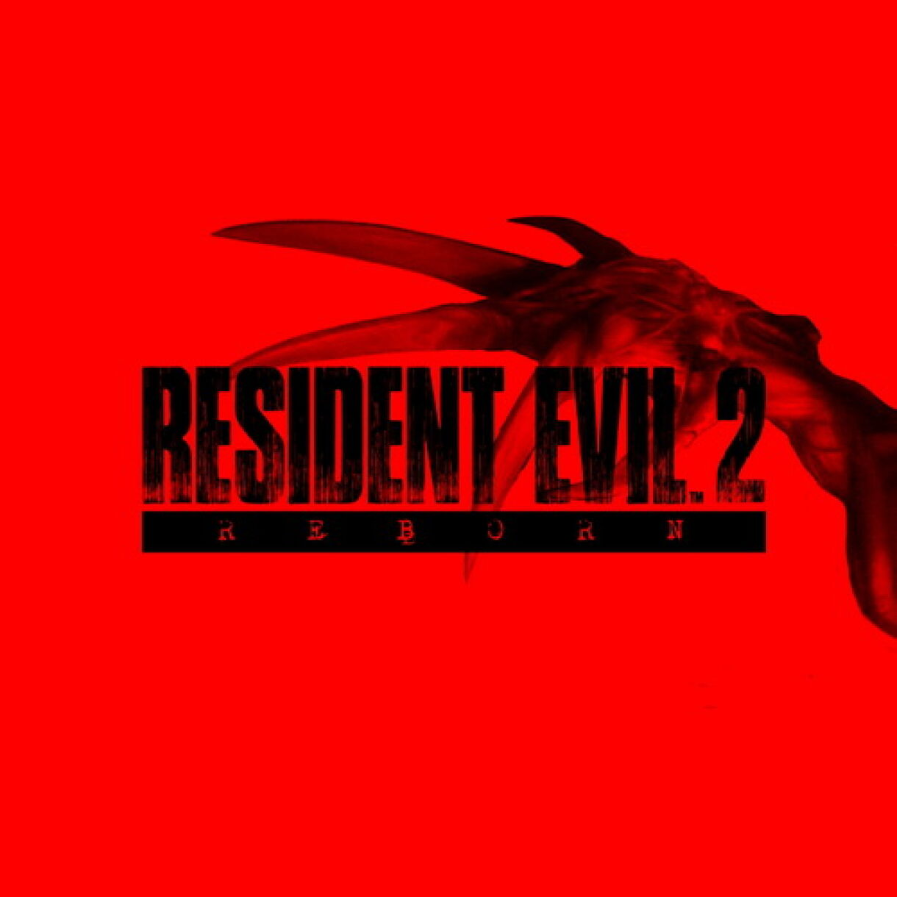
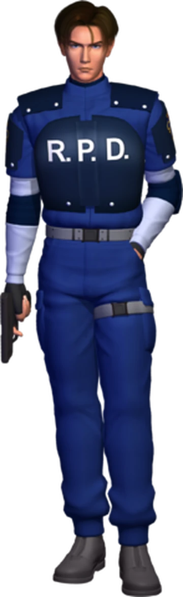
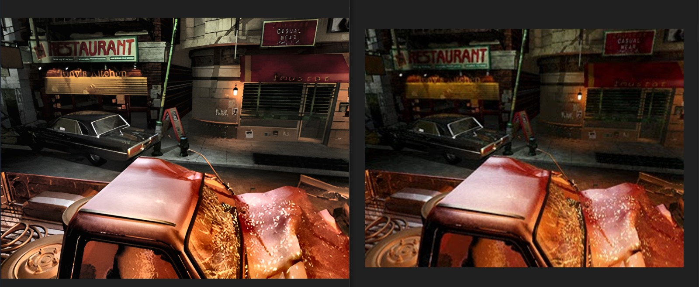
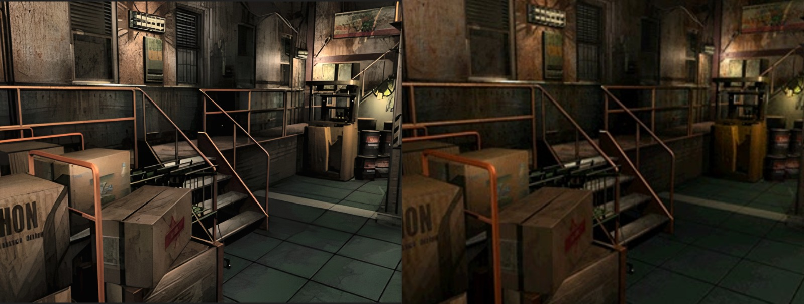
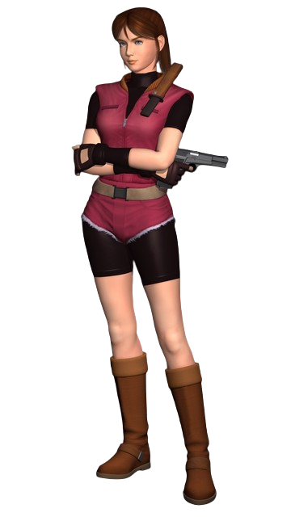

# RE2 Background Enhancer

<div align="left">



[](https://github.com/xinntao/Real-ESRGAN)
[](https://python.org)
[](https://pytorch.org)
[](https://opencv.org)

*Enhance prerendered backgrounds from PS1 games and retro titles with cutting-edge AI upscaling and atmospheric effects*

[Quick Start](#installation) • [Features](#features) • [Gallery](#gallery)

</div>

---

## Story

<div align="left">

<table border="0" cellspacing="0" cellpadding="0">
<tr>
<td width="30%" align="left" valign="top">



**Leon S. Kennedy**  
*The rookie cop on his first day*

</td>
<td width="70%" align="left" valign="top">

## Overview

**Background Image Enhancer** brings classic prerendered backgrounds from PS1 games and retro titles back to life with modern AI enhancement techniques. 

Using Real-ESRGAN's state-of-the-art upscaling technology combined with custom atmospheric effects, transform retro game backgrounds into stunning, high-resolution masterpieces that capture the nostalgic atmosphere of classic gaming.

Whether you're a retro gaming enthusiast, content creator, or want to relive the golden age of gaming with enhanced visuals, this tool delivers professional-grade results with an intuitive command-line interface.

</td>
</table>

</div>

---

### Core Enhancement Pipeline

- **4x Real-ESRGAN Upscaling**: Industry-leading super-resolution using ESRGAN architecture
- **CLAHE Detail Enhancement**: Contrast Limited Adaptive Histogram Equalization for texture sharpening
- **Atmospheric Color Grading**: Custom eerie effects with fog, temperature, and saturation controls
- **Film Grain & Noise**: Authentic retro game aesthetic with configurable grain effects

### Advanced Processing Options

- **Multiple Enhancement Methods**: CLAHE, detail layer, combined, and text-aware sharpening
- **Flexible Input Support**: Process RAR archives or directory structures
- **Batch Processing**: Handle hundreds of background images automatically
- **Quality Metrics**: Built-in PSNR/SSIM calculation for enhancement validation

### Developer-Friendly

- **Typer CLI**: Modern, intuitive command-line interface with rich help
- **Comprehensive Testing**: Full pytest coverage with fixtures and mocks
- **Modular Architecture**: Clean separation of concerns for easy extension
- **Logging & Visualization**: Detailed logs and before/after comparison tools

## Tech Stack

- **Python 3.10+**: Core programming language
- **PyTorch 2.0+**: Deep learning framework for AI models
- **Real-ESRGAN**: State-of-the-art super-resolution AI model
- **OpenCV**: Computer vision library for image and video processing
- **NumPy**: Numerical computing for image manipulation
- **Typer**: Modern command-line interface framework
- **Poetry**: Dependency management and packaging

## Gallery

### Before vs After Comparisons

<div align="left">

<div align="left">

#### Resident evil 2 - Classic Backgrounds | Enhanced in the right and original in the left



#### Resident evil 3 - Classic Backgrounds | Enhanced in the right and original in the left



</div>

</div>

## Installation

### Prerequisites

- Python 3.10 or higher
- CUDA-compatible GPU (recommended for faster processing)
- 8GB+ RAM for large batch processing

### Quick Install

```bash
# Clone the repository
git clone https://github.com/yourusername/re2-bg-enhancer.git
cd re2-bg-enhancer

# Install with Poetry (recommended)
poetry install

# Or install with pip
pip install -r requirements.txt
```

### Download Models

```bash
# Download Real-ESRGAN models
bash scripts/download_models.sh
```

## Usage

### Basic Enhancement

```bash
# Process all images in a directory
res-enhance data/raw/BioHazard_2/

# Process a RAR archive
res-enhance path/to/backgrounds.rar
```

### Advanced Enhancement Pipeline

```bash
# Full enhancement with all effects
res-enhance data/raw/BioHazard_2/ \
  --enhance-details \
  --atmospheric \
  --blur-strength 47 \
  --haze 17 \
  --temp -8 \
  --tint 30 \
  --saturation 13 \
  --grain 95
```

### Custom Atmospheric Settings

```bash
# Eerie night atmosphere
res-enhance data/raw/BioHazard_2/ --atmospheric --temp -15 --haze 25

# Foggy dawn look
res-enhance data/raw/BioHazard_2/ --atmospheric --temp -5 --tint 10 --blur-strength 60

# High contrast dramatic
res-enhance data/raw/BioHazard_2/ --atmospheric --saturation 20 --contrast 15
```

### Visualization & Analysis

```bash
# Generate before/after comparison plots
python -c "from src.utils.viz import visualize_sample_enhancements; from pathlib import Path; visualize_sample_enhancements(list(Path('data/enhanced').glob('*.png')))"
```

## Project Structure

```
re2-bg-enhancer/
├── configs/                 # Configuration files
│   ├── logging.yaml        # Logging configuration
│   └── models.yaml         # Model settings
├── data/                   # Data directories
│   ├── raw/               # Input images/archives
│   ├── enhanced/          # Output enhanced images
│   └── input/             # Temporary processing files
├── images/                 # Project images and logos
│   ├── RE2_Logo.jpg       # Resident Evil 2 logo
│   ├── Claire_Redfield.png # Claire character image
│   └── Leon_kennedy.png   # Leon character image
├── logs/                   # Logs and visualizations
│   └── visualizations/    # Before/after comparison plots
├── src/                    # Source code
│   ├── cli.py             # Main command-line interface
│   ├── data/
│   │   ├── loader.py      # Image loading and extraction
│   │   └── transforms.py  # Image preprocessing
│   ├── enhancement/
│   │   ├── upscaler.py    # Real-ESRGAN integration
│   │   ├── detail_enhancer.py  # CLAHE and detail enhancement
│   │   └── atmospheric.py # Color grading and effects
│   └── utils/
│       ├── logging.py     # Structured logging setup
│       ├── metrics.py     # Quality metrics (PSNR/SSIM)
│       └── viz.py         # Visualization utilities
├── tests/                  # Test suites
│   ├── conftest.py        # Test fixtures
│   ├── test_data.py       # Data pipeline tests
│   ├── test_enhancement.py # Enhancement tests
│   └── test_utils.py      # Utility tests
├── scripts/               # Automation scripts
│   ├── download_models.sh # Model download script
│   └── run_full_pipeline.sh # Full processing pipeline
└── pyproject.toml         # Project configuration
```

## Configuration

### Atmospheric Presets

The tool includes carefully tuned atmospheric presets inspired by classic survival horror and retro gaming aesthetics:

| Preset   | Blur | Haze | Temp | Tint | Saturation | Brightness | Grain | Description               |
| -------- | ---- | ---- | ---- | ---- | ---------- | ---------- | ----- | ------------------------- |
| Eerie    | 47   | 17   | -8   | 30   | 13         | 1          | 95    | Classic horror atmosphere |
| Foggy    | 60   | 25   | -5   | 10   | 5          | 0          | 80    | Misty night scenes        |
| Dramatic | 30   | 10   | -12  | 20   | 20         | -5         | 70    | High contrast horror      |

### Model Configuration

Real-ESRGAN models are automatically downloaded and configured. The tool uses:

- **RealESRGAN_x4plus**: General-purpose 4x upscaling
- **RealESRGAN_x4plus_anime**: Optimized for detailed textures (optional)

## Testing

Run the comprehensive test suite:

```bash
# Run all tests
pytest tests/

# Run with coverage
pytest --cov=src tests/

# Run specific test file
pytest tests/test_enhancement.py -v
```

## Performance

### Hardware Requirements

- **Minimum**: CPU-only, 4GB RAM, 2GB storage
- **Recommended**: NVIDIA GPU (RTX 30-series+), 16GB RAM, 10GB storage
- **Optimal**: NVIDIA RTX 40-series, 32GB+ RAM, SSD storage

### Processing Speeds

- **CPU**: ~30-60 seconds per image
- **GPU**: ~5-15 seconds per image
- **Batch Processing**: Scales linearly with available VRAM

## Contributing

We welcome contributions! Please see our [Contributing Guide](CONTRIBUTING.md) for details.

### Development Setup

```bash
# Fork and clone
git clone https://github.com/MohamedIKenedy/retro-bg-sr-Retro-Background-Super-Resolution.git
cd re2-bg-enhancer

# Install in development mode
poetry install --with dev

# Run tests
pytest

# Format code
black src/ tests/
ruff check src/ tests/
```

### Adding New Effects

1. Create new enhancement module in `src/enhancement/`
2. Add CLI parameters in `src/cli.py`
3. Write comprehensive tests
4. Update documentation

## License

This project is licensed under the MIT License.

## Acknowledgments

- **Real-ESRGAN**: For the incredible upscaling technology
- **Resident Evil Community**: For preserving gaming history
- **Open Source Contributors**: For the amazing libraries that make this possible

## About Prerendered Backgrounds

Prerendered backgrounds were a hallmark of 1990s gaming, especially in PS1-era titles and classic survival horror games like the Resident Evil series. These meticulously crafted 2D backgrounds brought immersive worlds to life despite technical limitations. This tool honors that legacy by enhancing the visual experience while preserving the original artistic intent and nostalgic charm of retro gaming.

---

<!-- Claire's character model moved here to avoid layout mismatch -->

<div align="left">

**Claire Redfield**  
*The determined college student searching for her brother*



</div>

<div align="left">

**Made with ❤️ for the retro gaming community**

[⭐ Star this repo](https://github.com/yourusername/re2-bg-enhancer) • [🐛 Report issues](https://github.com/yourusername/re2-bg-enhancer/issues) • [💬 Join discussions](https://github.com/yourusername/re2-bg-enhancer/discussions)

</div>
